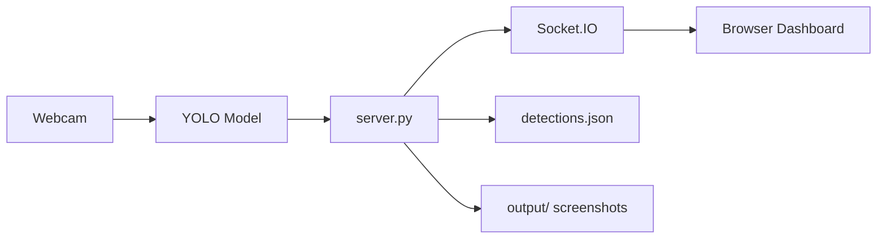

# How to Run the Arrohan 2025 Project

Complete step-by-step guide to run the real-time YOLO detection system with live dashboard.

---

## Project Overview

This project consists of three main components:

1. **Server** ([server.py](file:///Users/ashishpaliwal/PycharmProjects/Arrohan_2025/server.py)) - Flask backend with Socket.IO for real-time detection
2. **Frontend Dashboard** - HTML/CSS/JavaScript web interface with live video feed
3. **Standalone Detection Script** ([predict.py](file:///Users/ashishpaliwal/PycharmProjects/Arrohan_2025/scripts/predict.py)) - Optional OpenCV-based detection viewer

---

## Prerequisites

Before running the code, ensure you have:

- ✅ **Python 3.8+** installed
- ✅ **Webcam** connected to your computer
- ✅ **YOLO Model** trained and saved at:
  ```
  /Users/ashishpaliwal/PycharmProjects/Arrohan_2025/experiments/YOLOv8-Training/Arrohan_Project_Run/weights/best.pt
  ```
- ✅ **Web Browser** (Chrome, Firefox, Safari, etc.)

---

## Installation & Setup

### 1. Navigate to Project Directory

Open Terminal and run:

```bash
cd /Users/ashishpaliwal/PycharmProjects/Arrohan_2025
```

### 2. Create and Activate Virtual Environment

If not already created:

```bash
python3 -m venv .venv
```

Activate the virtual environment:

```bash
source .venv/bin/activate
```

> **Note:** Your terminal prompt should now show `(.venv)` indicating the virtual environment is active.

### 3. Install Dependencies

Install all required Python packages:

```bash
pip install -r requirements.txt
```

This will install:
- `flask==3.0.0` - Web framework
- `flask-socketio==5.3.5` - Real-time communication
- `flask-cors==4.0.0` - Cross-origin resource sharing
- `python-socketio==5.10.0` - Socket.IO client
- `opencv-python` - Computer vision library
- `ultralytics` - YOLO framework
- `pillow` - Image processing

---

## Running the Application

You have **two options** for running the detection system:

### Option 1: Real-Time Dashboard (Recommended) 🌟

This runs a complete web-based dashboard with live video streaming and incident tracking.

#### Step 1: Start the Server

```bash
python server.py
```

**Expected Output:**

```
============================================================
YOLO Real-Time Detection Server
============================================================
Loaded X detections from detections.json
Starting detection loop...
Model loaded successfully
Webcam opened. Streaming at 15 FPS
Server starting on http://127.0.0.1:5500
Streaming at 15 FPS with confidence threshold 0.7
============================================================
```

#### Step 2: Open the Dashboard

Open your web browser and navigate to:

```
http://127.0.0.1:5500
```

or

```
http://localhost:5500
```

#### Step 3: Verify Connection

Within 2-3 seconds you should see:

✅ **Status banner** turns green with "Connected to live detection server"  
✅ **"LIVE"** badge appears next to "Live Detection Feed"  
✅ **Detection count** shows numbers (not "—")  

#### Step 4: View Live Feed

Click the **"Show Feed"** button to display your webcam with real-time object detection boxes.

---

### Option 2: Standalone Detection Script

This runs a simple OpenCV window with YOLO detection (no web dashboard).

```bash
python scripts/predict.py
```

**Features:**
- Opens an OpenCV window showing webcam feed
- Draws bounding boxes on detected objects
- Auto-saves high-confidence detections (>0.6) to `output/` folder
- Press `q` to quit

---

## Understanding the System

### How the Real-Time Dashboard Works



1. **Server** ([server.py](file:///Users/ashishpaliwal/PycharmProjects/Arrohan_2025/server.py)):
   - Captures frames from webcam at 15 FPS
   - Runs YOLO inference on each frame
   - Streams annotated video to browser via Socket.IO
   - Saves high-confidence detections (≥0.7) as screenshots
   - Logs all detections to [detections.json](file:///Users/ashishpaliwal/PycharmProjects/Arrohan_2025/detections.json)

2. **Frontend** ([index.html](file:///Users/ashishpaliwal/PycharmProjects/Arrohan_2025/The Front end website/index.html), [app.js](file:///Users/ashishpaliwal/PycharmProjects/Arrohan_2025/The Front end website/app.js)):
   - Connects to server via Socket.IO
   - Displays live video feed
   - Shows real-time incident table
   - Updates detection statistics

3. **Detections Storage**:
   - **JSON Database**: [detections.json](file:///Users/ashishpaliwal/PycharmProjects/Arrohan_2025/detections.json) stores all detection metadata
   - **Screenshots**: [output/](file:///Users/ashishpaliwal/PycharmProjects/Arrohan_2025/output) folder contains annotated images

### Key Configuration Settings

Located in [server.py](file:///Users/ashishpaliwal/PycharmProjects/Arrohan_2025/server.py) (lines 17-28):

| Setting | Value | Description |
|---------|-------|-------------|
| `CONFIDENCE_THRESHOLD` | 0.7 | Minimum confidence to save detection |
| `COOLDOWN_SECONDS` | 2 | Wait time between consecutive saves |
| `TARGET_FPS` | 15 | Frame rate for video streaming |

---

## File Structure

```
Arrohan_2025/
├── server.py                    # Main Flask server with Socket.IO
├── requirements.txt             # Python dependencies
├── detections.json             # Database of all detections
├── The Front end website/      # Frontend files
│   ├── index.html              # Main dashboard HTML
│   ├── app.js                  # Frontend JavaScript logic
│   └── styles.css              # Dashboard styling
├── scripts/
│   └── predict.py              # Standalone detection script
├── output/                     # Screenshots of detections
├── models/                     # YOLO model storage
└── experiments/
    └── YOLOv8-Training/
        └── Arrohan_Project_Run/
            └── weights/
                └── best.pt     # Trained YOLO model
```

---

## Troubleshooting

### Problem: "Model not found"

**Error Message:**
```
Model not found at /Users/ashishpaliwal/PycharmProjects/Arrohan_2025/experiments/YOLOv8-Training/Arrohan_Project_Run/weights/best.pt
```

**Solution:**
- Verify the model file exists at the specified path
- If using a different model path, update `MODEL_PATH` in [server.py](file:///Users/ashishpaliwal/PycharmProjects/Arrohan_2025/server.py) line 19

---

### Problem: "Could not open webcam"

**Error Message:**
```
Error: Could not open webcam
```

**Solutions:**

1. **Check webcam is connected:**
   - Verify your webcam is plugged in
   - Try opening Photo Booth or another camera app to test

2. **Grant camera permissions:**
   - **macOS:** System Preferences → Security & Privacy → Privacy → Camera
   - Enable camera access for Terminal/iTerm

3. **Close other camera apps:**
   - Make sure no other applications are using the webcam
   - Close Zoom, FaceTime, etc.

4. **Try different camera index:**
   - Edit [server.py](file:///Users/ashishpaliwal/PycharmProjects/Arrohan_2025/server.py) line 114
   - Change `cv2.VideoCapture(0)` to `cv2.VideoCapture(1)` or `cv2.VideoCapture(2)`

---

### Problem: Dashboard shows "Initializing connection..."

**Symptoms:**
- Status banner stays yellow
- "LIVE" badge never appears
- No detections shown

**Solutions:**

1. **Hard refresh the browser:**
   - **Mac:** `Cmd + Shift + R`
   - **Windows/Linux:** `Ctrl + Shift + R`

2. **Check server is running:**
   - Look at the terminal where you ran `python server.py`
   - Should see continuous detection messages

3. **Check browser console:**
   - Press `F12` or right-click → Inspect
   - Go to Console tab
   - Look for connection errors

4. **Restart the server:**
   ```bash
   # Press Ctrl + C in the terminal
   python server.py
   # Then refresh browser
   ```

---

### Problem: Port already in use

**Error Message:**
```
OSError: [Errno 48] Address already in use
```

**Solution:**

1. **Find and kill the process:**
   ```bash
   lsof -i :5000
   kill -9 <PID>
   ```

2. **Or change the port:**
   - Edit [server.py](file:///Users/ashishpaliwal/PycharmProjects/Arrohan_2025/server.py) line 277
   - Change `port=5000` to `port=5001`
   - Access dashboard at `http://localhost:5001`

---

### Problem: No detections appearing

**Symptoms:**
- Dashboard connected but incident table empty
- Server running but not logging detections

**Possible Causes:**

1. **No objects in view:**
   - Point webcam at objects the model is trained to detect
   - Check what classes your model recognizes

2. **Confidence too low:**
   - Detections below 0.7 confidence are not saved
   - Lower `CONFIDENCE_THRESHOLD` in [server.py](file:///Users/ashishpaliwal/PycharmProjects/Arrohan_2025/server.py) line 25

3. **Cooldown active:**
   - System waits 2 seconds between saves
   - Reduce `COOLDOWN_SECONDS` if needed

---

### Problem: Video feed shows black/no image

**Solutions:**

1. **Check server terminal for errors:**
   - Look for "Failed to read frame" messages

2. **Verify webcam permissions** (see "Could not open webcam" above)

3. **Check browser console** (F12 → Console) for errors

4. **Try standalone script:**
   ```bash
   python scripts/predict.py
   ```
   If this works, the issue is with Socket.IO streaming

---

## Stopping the Application

### To stop the server:

1. Go to the terminal window running `server.py`
2. Press `Ctrl + C`
3. Wait for graceful shutdown:
   ```
   Webcam released
   ```

### To stop the standalone script:

1. Click on the OpenCV window
2. Press `q` key

---

## Quick Reference Commands

### Complete Startup Sequence

```bash
# 1. Navigate to project
cd /Users/ashishpaliwal/PycharmProjects/Arrohan_2025

# 2. Activate virtual environment
source .venv/bin/activate

# 3. Install/update dependencies (first time only)
pip install -r requirements.txt

# 4. Start the server
python server.py

# 5. Open browser to http://127.0.0.1:5000
```

### Check What's Running

```bash
# Check if server is running on port 5000
lsof -i :5000

# Check Python processes
ps aux | grep python

# Check virtual environment is active
which python
# Should show: /Users/ashishpaliwal/PycharmProjects/Arrohan_2025/.venv/bin/python
```

---

## Advanced: Modifying Detection Settings

### Change Confidence Threshold

Edit [server.py](file:///Users/ashishpaliwal/PycharmProjects/Arrohan_2025/server.py) line 25:

```python
CONFIDENCE_THRESHOLD = 0.7  # Change to 0.5 for more detections, 0.9 for fewer
```

### Change Frame Rate

Edit [server.py](file:///Users/ashishpaliwal/PycharmProjects/Arrohan_2025/server.py) line 27:

```python
TARGET_FPS = 15  # Change to 30 for smoother video (uses more CPU)
```

### Change Cooldown Period

Edit [server.py](file:///Users/ashishpaliwal/PycharmProjects/Arrohan_2025/server.py) line 26:

```python
COOLDOWN_SECONDS = 2  # Change to 5 for less frequent saves
```

---

## Where Data is Stored

### Detection Metadata

**File:** [detections.json](file:///Users/ashishpaliwal/PycharmProjects/Arrohan_2025/detections.json)

```json
[
  {
    "id": 1,
    "type": "car",
    "severity": "High",
    "status": "Open",
    "zone": "Camera-1",
    "detectedAt": "2025-12-08T18:00:00",
    "drone": "Webcam-YOLO",
    "evidenceUrl": "/output/detection_1_conf0.85.jpg",
    "confidence": 0.85
  }
]
```

### Detection Screenshots

**Directory:** [output/](file:///Users/ashishpaliwal/PycharmProjects/Arrohan_2025/output)

Files named: `detection_{frame_count}_conf{confidence}.jpg`

Example: `detection_42_conf0.87.jpg`

---

## API Endpoints

### REST API

#### Get All Incidents

```http
GET http://127.0.0.1:5000/api/incidents
```

**Response:**
```json
{
  "incidents": [...],
  "place_id": "default"
}
```

#### Get Screenshots

```http
GET http://127.0.0.1:5000/output/detection_1_conf0.85.jpg
```

### Socket.IO Events

#### Client → Server

- `connect` - Establish connection
- `disconnect` - Close connection
- `request_history` - Request all historical detections

#### Server → Client

- `connection_status` - Connection confirmation
- `detection_stats` - Statistics update
- `video_frame` - Live video frame (base64 JPEG)
- `new_detection` - New detection event
- `detection_history` - Historical detections

---

## Next Steps

Once you have the system running:

1. **Test with different objects** - See what your model detects
2. **Review detections** - Check [detections.json](file:///Users/ashishpaliwal/PycharmProjects/Arrohan_2025/detections.json) and screenshots in [output/](file:///Users/ashishpaliwal/PycharmProjects/Arrohan_2025/output)
3. **Adjust settings** - Tune confidence threshold and cooldown
4. **Monitor performance** - Watch CPU usage and frame rate
5. **Integrate with other systems** - Use the REST API or Socket.IO events

---

## Getting Help

If you encounter issues not covered in this guide:

1. Check the **server terminal** for error messages
2. Check the **browser console** (F12) for frontend errors
3. Verify all **file paths** are correct
4. Ensure **webcam permissions** are granted
5. Try the **standalone script** to isolate issues

---

## Summary

| Component | Command | Access |
|-----------|---------|--------|
| **Real-time Dashboard** | `python server.py` | http://localhost:5000 |
| **Standalone Script** | `python scripts/predict.py` | OpenCV window |
| **Detection Database** | - | [detections.json](file:///Users/ashishpaliwal/PycharmProjects/Arrohan_2025/detections.json) |
| **Screenshots** | - | [output/](file:///Users/ashishpaliwal/PycharmProjects/Arrohan_2025/output) folder |

**Default Settings:**
- Confidence Threshold: 0.7
- Frame Rate: 15 FPS
- Cooldown: 2 seconds
- Port: 5000

---

**Happy Detecting! 🚀**
